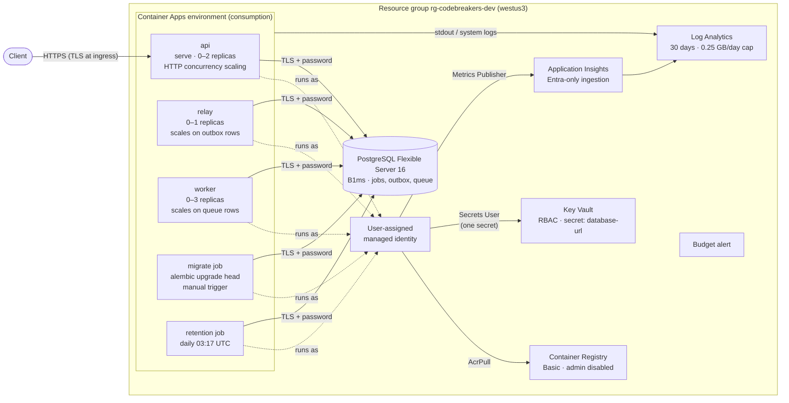

# ADR-0012: Azure Development Environment

## Status

Accepted. Amends [ADR-0003](ADR-0003-azure-target.md): Service Bus is deferred
from the first cloud environment. Extends
[ADR-0010](ADR-0010-containers-local-stack.md): the PostgreSQL queue also runs
in Azure `dev`. Amended by [ADR-0013](ADR-0013-continuous-delivery.md):
GitHub Actions releases images and API revisions, and Terraform ignores them.
Also amended by [ADR-0014](ADR-0014-observability.md), which adds operational
alerts.

## Context

Phase 8 deploys the Phase 7 image to Azure with Terraform
([ADR-0011](ADR-0011-terraform.md)). The goal is a credible, low-cost portfolio
demo: a public HTTPS API that completes a queued analysis end to end. It
should use managed identities where Azure supports them, and its cost,
identity, backup, and teardown decisions should be explicit. It is not a
production service, and every simplification below is recorded rather than
made silently.

## Decision

### Region and environments

- **Region:** `westus3` for every resource. It offers Container Apps and
  PostgreSQL Flexible Server with US-standard pricing.
- **Environments:** `environments/dev.tfvars` and `prod.tfvars` share one
  definition. `dev` scales to zero and has no delete protection. `prod` keeps
  one warm API replica, uses a larger database SKU and 14-day backups, and
  sets `protect_stateful_resources = true`, which adds a database delete lock
  and Key Vault purge protection. Only `dev` is deployed in Phase 8.

### Deployment

Every Container Apps role runs the same immutable image tag, which is a Git
SHA (`latest` is rejected). Each role is a separate app with its own replicas,
resources, and scale rule:

| Role | Command | CPU / memory | Replicas (dev) | Scaling |
|------|---------|--------------|----------------|---------|
| api | `serve --host 0.0.0.0 --port 8000 --graceful-timeout 10` | 0.5 / 1 GiB | 0–2 | HTTP, 20 concurrent requests per replica |
| relay | `relay` | 0.25 / 0.5 GiB | 0–1 | KEDA `postgresql`: `COUNT(*)` of `analysis_outbox` |
| worker | `worker` | 0.5 / 1 GiB | 0–3 | KEDA `postgresql`: undead-lettered `analysis_job_queue` rows, 5 per replica |
| migrate (job) | `alembic upgrade head` | 0.25 / 0.5 GiB | one execution | Manual trigger |
| retention (job) | `python -m codebreakers.infrastructure.persistence.retention` | 0.25 / 0.5 GiB | one execution | Cron `17 3 * * *` |

- **Revisions:** the relay and worker use single revision mode. The API uses
  multiple revision mode so releases can shift traffic explicitly instead of
  automatically sending all traffic to the latest revision
  ([ADR-0013](ADR-0013-continuous-delivery.md)).
- **Health:** the API has startup and liveness probes on `/health/live` and a
  readiness probe on `/health/ready`, which includes a database check. Container
  Apps probes are HTTP or TCP only, so the relay and worker have no probes.
  Instead they rely on process exit and restart. The ADR-0010 heartbeat file
  stays a Compose-only check.
- **Shutdown:** termination grace is 15 s for the API and relay and 45 s for
  the worker, which exceeds the 30 s analysis budget.
- **Migrations** run once per release as a job, never from API replicas
  (ADR-0010).

### Substitutions for the first cloud demo

| Planned (ADR-0003) | Dev uses | Why | Path back |
|--------------------|----------|-----|-----------|
| Azure Service Bus | PostgreSQL queue (`CODEBREAKERS_ANALYSIS_QUEUE=postgres`) | One less resource and identity to manage. The queue already passes the shared `JobPublisher` contract and has the same peek-lock, retry, and dead-letter semantics (ADR-0010). Scaling uses KEDA's `postgresql` scaler instead of queue depth. | Add a Basic-tier namespace and queue. Set `CODEBREAKERS_ANALYSIS_QUEUE=service-bus`, add Service Bus Data Sender/Receiver roles, and use the `azure-servicebus` scale rule with managed identity. The application code is unchanged except for credential-based client construction. |
| Microsoft Entra database auth | Password auth. The full URL is a Key Vault secret. | Entra auth needs a database role for the managed identity, created with SQL after provisioning, plus a token-refreshing connection hook in the application. | Enable `active_directory_auth_enabled`, create the identity's role with `pgaadauth_create_principal`, and inject tokens in `create_postgres_engine`. This also removes the password from Terraform state. |
| Dedicated least-privilege DB role | The server administrator login | Creating roles needs SQL, which Terraform's `azurerm` provider does not run. | Have the migrate job create an application role, and point the secret at it. |
| Private networking | Public endpoints with firewall and RBAC | Private endpoints and VNet integration add cost and complexity that a demo does not justify. | Use a workload-profiles environment in a VNet, delegated-subnet PostgreSQL, and private endpoints. |

### Identity

One user-assigned identity is shared by every app and job. They run the same
image and need the same permissions, so separate identities would add
assignments without reducing access.

| Permission | Role | Scope |
|------------|------|-------|
| Pull images | AcrPull | The registry |
| Read the database URL | Key Vault Secrets User | The `database-url` secret only |
| Send telemetry | Monitoring Metrics Publisher | The Application Insights component |

- Registry admin credentials are disabled, so image pulls use the identity.
- Application Insights has local authentication disabled. The exporter uses
  `ManagedIdentityCredential` (`AZURE_CLIENT_ID`), so the connection string
  alone cannot ingest telemetry. This makes it a plain environment variable
  rather than a secret.
- The **only password** is PostgreSQL's (see substitutions). It lives in Key
  Vault and reaches the containers and KEDA scale rules through Container Apps
  Key Vault references. It is never a Terraform output or plain environment
  value. The identity running Terraform holds *Key Vault Secrets Officer* so
  it can write it.
- New role assignments wait 60 s (`time_sleep`) for Azure RBAC propagation,
  so the first apply does not fail on image pulls or secret reads.

### Trust boundaries and public endpoints

| Boundary | Public endpoint | Controls |
|----------|-----------------|----------|
| Internet → API | `https://ca-codebreakers-dev-api.<env>.westus3.azurecontainerapps.io` | TLS terminates at ingress, and plain HTTP is redirected to HTTPS (`allow_insecure_connections = false`). Request-size limits and RFC 7807 errors come from the application. No authentication: Phase 9 adds rate limiting before the URL is advertised. |
| Apps → PostgreSQL | `psql-cbdev….postgres.database.azure.com:5432` | TLS required (`sslmode=require`) plus a 32-character password. The firewall allows Azure services only (`0.0.0.0`), which includes other tenants' Azure workloads, because consumption Container Apps have no fixed egress IP. This is the weakest boundary and the first to tighten. |
| Apps → Key Vault, registry, Application Insights | Azure service endpoints | Microsoft Entra RBAC through the managed identity. There are no keys or passwords. |
| Operator → Azure | Azure Resource Manager | `az login` identity. Terraform state is Entra-only (ADR-0011). |

Data sensitivity: submitted ciphertext is stored only until the job reaches a
terminal state (ADR-0008). Results, which can contain candidate plaintext, are
deleted after 7 days by the retention job. Logs and telemetry carry
identifiers, not payloads.

### Cost

Estimated with `westus3` retail prices (October 2026) for 730 hours a month.
The figures are illustrative; the budget alert is the real guard.

| Resource | Basis | Monthly (USD) |
|----------|-------|---------------|
| PostgreSQL B1ms compute | $0.017/h | 12.41 |
| PostgreSQL storage, 32 GB | $0.115/GB | 3.68 |
| PostgreSQL backups, 7 days | Free up to provisioned storage | 0 |
| Container Registry Basic | $0.1666/day | 5.07 |
| Container Apps (consumption) | Scale to zero; demo traffic fits the monthly free grant (180k vCPU-s, 360k GiB-s, 2M requests) | ~0 |
| Log Analytics and Application Insights | First 5 GB/month free per billing account, then $2.30/GB; 0.25 GB/day cap | 0–6 |
| Key Vault, budget, identity, state storage | Operations and KB-scale storage | < 1 |
| **Expected total** | | **~$21–27** |

- **Budget:** a resource-group budget of $40/month (prod: $100) alerts at 80 %
  and 100 % of actual spend and at 100 % of forecast.
- **Cost levers:** `az postgres flexible-server stop` saves about $12/month
  between demos. Azure restarts stopped servers after 7 days. `terraform
  destroy` removes everything except the shared state account.

### Backup, retention, and teardown

- **Backups:** PostgreSQL keeps automated, locally redundant backups with a
  7-day point-in-time restore window (prod: 14 days). Geo-redundant backup is
  off. Dev data is disposable.
- **Retention:** finished analyses after 7 days (daily job), logs after 30 days,
  and Terraform state versions after 30 days of soft delete.
- **Teardown:** `terraform destroy` removes the whole dev environment. Dev
  turns off delete protection, so the destroy deletes the database and its
  backups and purges the Key Vault. Prod's delete lock and purge protection
  make a destroy fail until someone removes them deliberately. Names carry a
  random suffix, so a recreated environment never collides with soft-deleted
  resources.

## Consequences

- One `terraform apply` plus an image build and a migration job produces a
  public HTTPS API that runs queued analyses
  ([runbook](../operations/azure-runbook.md)). Idle compute scales to zero.
- The deployed queue differs from the ADR-0003 target until Service Bus is
  enabled. The adapter, contract tests, and manual integration workflow keep
  the Service Bus path working in the meantime.
- The database password and the open "Azure services" firewall rule are the
  known gaps against least privilege. Both have a documented path back.
- From an idle state, the first job takes about 1–2 minutes: one KEDA polling
  interval to start the relay, one to start a worker, plus cold starts.
  That is acceptable for a demo but not for interactive latency targets.
