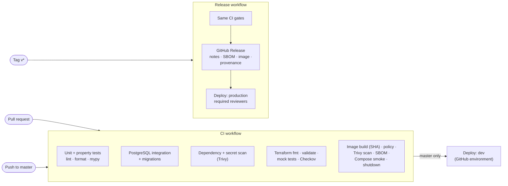

# ADR-0013: Continuous Delivery to Azure Container Apps

## Status

Accepted. Amends [ADR-0012](ADR-0012-azure-dev-environment.md): after the
first apply, GitHub Actions rather than Terraform rolls out new images.

## Context

Phase 8 released by hand. An operator built and pushed the image locally,
then applied Terraform with a new `image_tag`. That flow was safe but slow,
and every step ran on a laptop. Phase 9 asks for releases that:

- build in CI with immutable tags,
- authenticate to Azure without long-lived secrets,
- test a new revision before users reach it,
- can be rolled back with one documented command,
- require human approval for production,
- publish release notes, an SBOM, and provenance.

Infrastructure changes remain rare and benefit from a reviewed plan, so the
question is which system owns which part of the running configuration.

## Decision

### Ownership split

| Concern | Owner |
| --- | --- |
| Resources, identities, scale rules, settings, alerts | Terraform, applied locally from a reviewed plan (`make tf-plan`, `make tf-apply`) |
| Which image runs, revision names, API traffic split | GitHub Actions (`scripts/deploy_revision.sh`) |

The container apps and jobs `ignore_changes` their image, revision suffix, and
traffic weights. Terraform still sets the image when it creates an app (the
first deployment needs `image_tag`), but later applies leave the image and
traffic that CI deployed in place. Running `terraform plan` after a CI deploy
therefore shows no drift.

### Pipeline

- **Immutable identity.** The image is built once per workflow run, with
  `CODEBREAKERS_REVISION` set to the commit SHA, and saved as an artifact. The
  deploy job loads that exact image, tags it `<acr>/codebreakers:<sha>`, and
  pushes it. `latest` is never pushed, and the deploy script refuses any tag
  that is not a 40-character SHA.
- **Caching without drift.** `actions/setup-python` caches pip downloads,
  keyed on `pyproject.toml` and the lock files. Buildx caches layers in the
  GitHub Actions cache. Neither cache can change what is installed: the base
  image is pinned by digest and the image installs only hash-locked
  requirements.
- **Scans by stage.**
  - Dependency and secret scans run on the source tree before any image
    exists.
  - Image vulnerability, secret, and policy checks run on the built image.
  - Checkov runs on the Terraform.
  - The policy matches `make scan`: HIGH findings are reported, and an
    unreviewed CRITICAL finding or any secret fails the run.
- **OIDC, not secrets.**
  - Terraform creates a deployment identity (`id-codebreakers-<env>-deploy`)
    with one federated credential. The credential trusts
    `repo:<owner>/<repo>:environment:<github_environment>`, so only jobs
    running in that GitHub environment can sign in as this identity.
  - The identity holds Contributor on the environment's resource group and
    AcrPush on its registry. Contributor is the narrowest built-in role that
    can update apps, jobs, revisions, and traffic. It cannot grant access.
  - The GitHub environment stores only non-secret identifiers, taken from
    the Terraform `github_environment_variables` output.
- **Pinned actions.** Every third-party action is pinned to a full commit
  SHA, with the release noted in a trailing comment. Dependabot updates the
  pins after a 7-day cooldown, and each update must pass CI.

### Staged rollout

The API runs in `Multiple` revision mode. The relay and worker have no
ingress and stay in `Single` mode. `scripts/deploy_revision.sh` deploys in
this order:

1. Pin all API traffic to the revision serving now, so a newly created
   revision cannot receive any.
2. Run migrations with the new image. Migrations must be backward compatible
   (expand, then contract), because the previous API keeps serving.
3. Roll the retention job, worker, and relay to the new image.
4. Create a new API revision with no traffic and wait for it to provision.
   Then run the end-to-end smoke test against its revision URL. The test also
   exercises the new relay and worker.
5. Shift 100% of traffic to the new revision. Keep the previous revision
   active and deactivate any older ones.

If any step before the traffic shift fails, the script restores the previous
worker, relay, and job images and deactivates the new revision. Users never
reach it.

`scripts/rollback_revision.sh`, also available as the **Rollback** workflow and
`make azure-rollback`, does the reverse:

- returns traffic to the previous revision, reactivating it if needed;
- realigns the worker, relay, and jobs with that revision's image;
- smoke-tests the result.

It does not reverse migrations, which is why migrations must be backward
compatible.

### Environments

- **`dev`:** deployed on every push to `master` after all CI gates pass.
- **`production`:** a GitHub environment with required reviewers. A `v*` tag
  runs the release workflow: the same CI gates, then a GitHub Release with
  generated notes, the image archive, and the CycloneDX SBOM. Those assets
  carry signed SLSA build provenance (`gh attestation verify`). The release
  then waits for approval and deploys the identical image.
- **Production is not provisioned yet** (ADR-0012). Until Terraform is
  applied with `prod.tfvars` and the environment variables are set, the
  production job passes the approval gate and then skips with a notice. The
  rollout and rollback mechanics are demonstrated on `dev`.

## Consequences

- A tagged release goes from source to Azure without local commands; only
  infrastructure changes still need a local, reviewed Terraform apply.
- An API template change applied by Terraform (for example a new setting)
  creates an API revision. Because CI pins traffic to a named revision, that
  revision receives no traffic until the next deploy promotes it, after a
  smoke test. Rerun the latest **CI** workflow on `master`, or run
  `make azure-deploy`, after such an apply.
- In production, keeping the previous revision active costs one extra warm
  replica, the price of instant rollback.
- The GitHub repository becomes part of the trust boundary. Branch protection
  on `master`, environment reviewers, and SHA-pinned actions are the controls
  (see the [threat model](../security/threat-model.md)).
- The Phase 8 manual release flow remains in the
  [Azure runbook](../operations/azure-runbook.md) for break-glass use.
